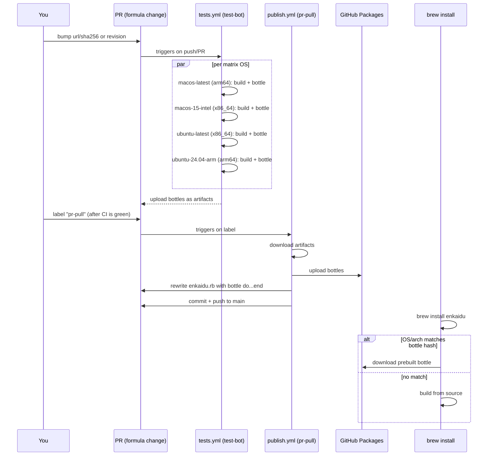

# `enkaidu-dev` Tap for Homebrew

> Enkaidu itself is [here](https://github.com/enkaidu-dev/enkaidu)

## How do I install Enkaidu?

### Direct

```sh
brew install enkaidu-dev/tap/enkaidu
```

### Tap first

```sh
brew tap enkaidu-dev/tap
```

And then

```sh
brew install enkaidu
```

### Bundle

Or, in a `brew bundle` `Brewfile`:

```ruby
tap "enkaidu-dev/tap"
brew "<formula>"
```

## Development

### Releasing a new version

1. Bump `url`/`sha256` in `Formula/enkaidu.rb` (or bump `revision` for a
   rebuild with no source change, e.g. retroactively adding bottles).
2. Push to a branch, open a PR against `main`.
3. Wait for `tests.yml` to go green on **all** matrix jobs (Linux x86_64/arm64,
   macOS arm64/x86_64) — check the PR's checks tab.
4. Label the PR `pr-pull`. **Do this only after step 3** — labeling early
   fails since there are no bottle artifacts yet.
5. `publish.yml` runs automatically: uploads bottles to GitHub Packages,
   writes the `bottle do...end` block into the formula, pushes to `main`,
   and auto-closes the PR.

If `pr-pull` fails (e.g. labeled too early), remove the label, confirm
`tests.yml` is fully green, then re-add it to retry.

### How it works

`tests.yml` (`brew test-bot`) builds the formula from source on each
matrix runner and uploads the result as a bottle artifact. `publish.yml`
(`brew pr-pull`), triggered by the `pr-pull` label, picks up those
artifacts, uploads them to GitHub Packages, rewrites the formula with the
resulting `bottle do...end` block, and pushes straight to `main`.



Once a bottle hash matches the installer's OS/arch, `brew install` skips
compiling Crystal/Node entirely and just downloads the binary.

### macOS vs Linux bottle matching

- **macOS bottles are tagged per OS version** (e.g. `arm64_sequoia`). A bottle
  built on `macos-15` only matches users on macOS 15. New major macOS
  release → no match → falls back to source build until we rebuild bottles
  for it. `check-new-macos.yml` runs monthly to detect this and open a PR
  automatically (see below).
- **Linux bottles are tagged by arch only** (`x86_64_linux`, `arm64_linux`),
  not distro or version. Homebrew on Linux doesn't link against host system
  libraries (besides glibc/gcc), so one bottle from `ubuntu-latest` covers
  Ubuntu, Debian, Fedora, etc. No per-distro CI matrix needed.

### `macos-latest` is a rolling alias — handle with care

GitHub silently repoints `macos-latest` to newer macOS versions over time
(it's how `macos-13` got Intel support quietly deprecated under us). We
intentionally left `macos-latest` unpinned so bottles auto-track new
arm64 macOS releases, but it's worth periodically confirming what it
currently resolves to via the GitHub Actions runner-images changelog.

### Auto-detecting new macOS releases

`check-new-macos.yml` runs monthly (and on demand) on `macos-latest`,
compares the runner's macOS major version against `.macos-version-tracked`,
and if newer, bumps `revision` and opens a PR — feeding the same
`tests.yml`/`publish.yml` pipeline above. It stops short of auto-labeling
`pr-pull`, so a human still confirms CI is green before bottles publish.
